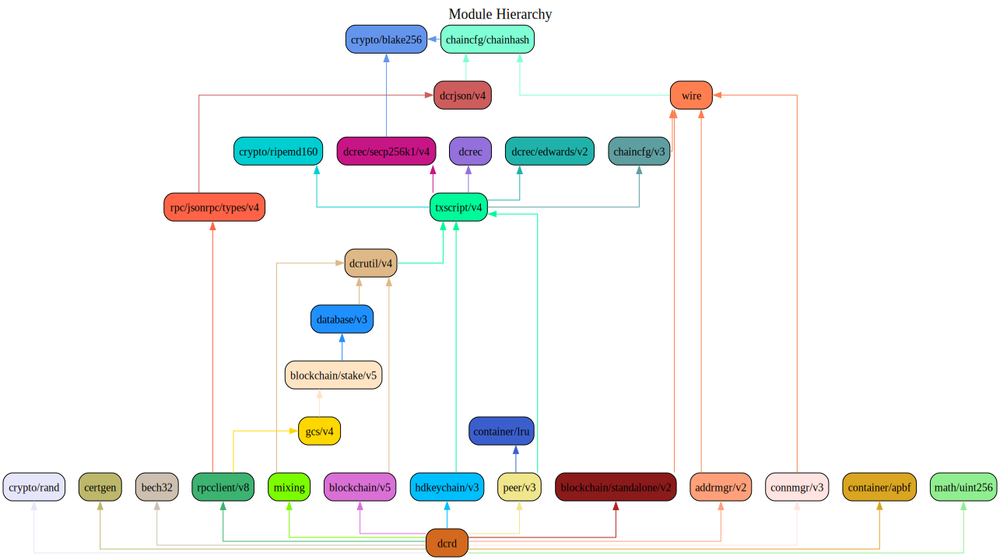

### Table of Contents
1. [About](#About)
2. [Getting Started](#GettingStarted)
    1. [Installation](#Installation)
    2. [Configuration](#Configuration)
    3. [Controlling and Querying vgld via vglctl](#vglctlConfig)
    4. [Mining](#Mining)
3. [Help](#Help)
    1. [Network Configuration](#NetworkConfig)
    2. [Wallet](#Wallet)
4. [Contact](#Contact)
    1. [Community](#ContactCommunity)
5. [Developer Resources](#DeveloperResources)
    1. [Code Contribution Guidelines](#ContributionGuidelines)
    2. [JSON-RPC Reference](#JSONRPCReference)
    3. [Go Modules](#GoModules)
    4. [Module Hierarchy](#ModuleHierarchy)
6. [Simulation Network (--simnet) Reference](#SimnetReference)

<a name="About" />

### 1. About

vgld is a full node Vigil implementation written in [Go](https://golang.org),
and is licensed under the [copyfree](http://www.copyfree.org) ISC License.

This software is currently under active development.  It is extremely stable and
has been in production use since February 2016.

It also properly relays newly mined blocks, maintains a transaction pool, and
relays individual transactions that have not yet made it into a block.  It
ensures all individual transactions admitted to the pool follow the rules
required into the block chain and also includes the vast majority of the more
strict checks which filter transactions based on miner requirements ("standard"
transactions).

<a name="GettingStarted" />

### 2. Getting Started

<a name="Installation" />

**2.1 Installation**<br />

The first step is to install vgld.  The installation instructions can be found
[here](https://github.com/vigilnetwork/vgl/tree/master/README.md#Installation).

<a name="Configuration" />

**2.2 Configuration**<br />

vgld has a number of [configuration](https://pkg.go.dev/github.com/vigilnetwork/vgl)
options, which can be viewed by running: `$ vgld --help`.

<a name="vglctlConfig" />

**2.3 Controlling and Querying vgld via vglctl**<br />

[vglctl](https://github.com/Vigil/vglctl) is a command line utility that can be
used to both control and query vgld via
[RPC](https://www.wikipedia.org/wiki/Remote_procedure_call).  vgld does **not**
enable its RPC server by default; You must configure at minimum both an RPC
username and password or both an RPC limited username and password:

* vgld.conf configuration file
```
[Application Options]
rpcuser=myuser
rpcpass=SomeDecentp4ssw0rd
rpclimituser=mylimituser
rpclimitpass=Limitedp4ssw0rd
```
* vglctl.conf configuration file
```
[Application Options]
rpcuser=myuser
rpcpass=SomeDecentp4ssw0rd
```
OR
```
[Application Options]
rpclimituser=mylimituser
rpclimitpass=Limitedp4ssw0rd
```
For a list of available options, run: `$ vglctl --help`

<a name="Mining" />

**2.4 Mining**<br />
vgld supports the [getwork](https://github.com/vigilnetwork/vgl/tree/master/docs/json_rpc_api.mediawiki#getwork)
RPC.  The limited user cannot access this RPC.<br />

**1. Add the payment addresses with the `miningaddr` option.**<br />

```
[Application Options]
rpcuser=myuser
rpcpass=SomeDecentp4ssw0rd
miningaddr=DsExampleAddress1
miningaddr=DsExampleAddress2
```

**2. Add vgld's RPC TLS certificate to system Certificate Authority list.**<br />

`cgminer` uses [curl](https://curl.haxx.se/) to fetch data from the RPC server.
Since curl validates the certificate by default, we must install the `vgld` RPC
certificate into the default system Certificate Authority list.

**Ubuntu**<br />

1. Copy rpc.cert to /usr/share/ca-certificates: `# cp /home/user/.vgld/rpc.cert /usr/share/ca-certificates/vgld.crt`<br />
2. Add vgld.crt to /etc/ca-certificates.conf: `# echo vgld.crt >> /etc/ca-certificates.conf`<br />
3. Update the CA certificate list: `# update-ca-certificates`<br />

**3. Set your mining software url to use https.**<br />

`$ cgminer -o https://127.0.0.1:9109 -u rpcuser -p rpcpassword`

<a name="Help" />

### 3. Help

<a name="NetworkConfig" />

**3.1 Network Configuration**<br />
* [What Ports Are Used by Default?](https://github.com/vigilnetwork/vgl/tree/master/docs/default_ports.md)
* [How To Listen on Specific Interfaces](https://github.com/vigilnetwork/vgl/tree/master/docs/configure_peer_server_listen_interfaces.md)
* [How To Configure RPC Server to Listen on Specific Interfaces](https://github.com/vigilnetwork/vgl/tree/master/docs/configure_rpc_server_listen_interfaces.md)
* [Configuring vgld with Tor](https://github.com/vigilnetwork/vgl/tree/master/docs/configuring_tor.md)

<a name="Wallet" />

**3.2 Wallet**<br />

vgld was intentionally developed without an integrated wallet for security
reasons.  Please see [vglwallet](https://github.com/Vigil/vglwallet) for more
information.

<a name="Contact" />

### 4. Contact

<a name="ContactCommunity" />

**4.1 Community**<br />

If you have any further questions you can find us at:

https://vigil.network/community/

<a name="DeveloperResources" />

### 5. Developer Resources

<a name="ContributionGuidelines" />

**5.1 Code Contribution Guidelines**

* [Code Contribution Guidelines](https://github.com/vigilnetwork/vgl/tree/master/docs/code_contribution_guidelines.md)

<a name="JSONRPCReference" />

**5.2 JSON-RPC Reference**

* [JSON-RPC Reference](https://github.com/vigilnetwork/vgl/tree/master/docs/json_rpc_api.mediawiki)
* [RPC Examples](https://github.com/vigilnetwork/vgl/tree/master/docs/json_rpc_api.mediawiki#8-example-code)

<a name="GoModules" />

**5.3 Go Modules**

The following versioned modules are provided by vgld repository:

* [rpcclient/v8](https://github.com/vigilnetwork/vgl/tree/master/rpcclient) - Implements
  a robust and easy to use Websocket-enabled Vigil JSON-RPC client
* [VGLjson/v4](https://github.com/vigilnetwork/vgl/tree/master/VGLjson) - Provides
  infrastructure for working with Vigil JSON-RPC APIs
* [rpc/jsonrpc/types/v4](https://github.com/vigilnetwork/vgl/tree/master/rpc/jsonrpc/types) -
  Provides concrete types via VGLjson for the chain server JSON-RPC commands,
  return values, and notifications
* [wire](https://github.com/vigilnetwork/vgl/tree/master/wire) - Implements the
  Vigil wire protocol
* [peer/v3](https://github.com/vigilnetwork/vgl/tree/master/peer) - Provides a common
  base for creating and managing Vigil network peers
* [blockchain/v5](https://github.com/vigilnetwork/vgl/tree/master/blockchain) -
  Implements Vigil block handling and chain selection rules
  * [stake/v5](https://github.com/vigilnetwork/vgl/tree/master/blockchain/stake) -
    Provides an API for working with stake transactions and other portions
    related to the Proof-of-Stake (PoS) system
  * [standalone/v2](https://github.com/vigilnetwork/vgl/tree/master/blockchain/standalone) -
    Provides standalone functions useful for working with the Vigil blockchain
    consensus rules
* [txscript/v4](https://github.com/vigilnetwork/vgl/tree/master/txscript) -
  Implements the Vigil transaction scripting language
* [VGLec](https://github.com/vigilnetwork/vgl/tree/master/VGLec) - Provides constants
  for the supported cryptographic signatures supported by Vigil scripts
  * [secp256k1/v4](https://github.com/vigilnetwork/vgl/tree/master/VGLec/secp256k1) -
    Implements the secp256k1 elliptic curve
  * [edwards/v2](https://github.com/vigilnetwork/vgl/tree/master/VGLec/edwards) -
    Implements the edwards25519 twisted Edwards curve
* [database/v3](https://github.com/vigilnetwork/vgl/tree/master/database) -
  Provides a database interface for the Vigil block chain
* [VGLutil/v4](https://github.com/vigilnetwork/vgl/tree/master/VGLutil) - Provides
  Vigil-specific convenience functions and types
* [chaincfg/v3](https://github.com/vigilnetwork/vgl/tree/master/chaincfg) - Defines
  chain configuration parameters for the standard Vigil networks and allows
  callers to define their own custom Vigil networks for testing purposes
  * [chainhash](https://github.com/vigilnetwork/vgl/tree/master/chaincfg/chainhash) -
    Provides a generic hash type and associated functions that allows the
    specific hash algorithm to be abstracted
* [certgen](https://github.com/vigilnetwork/vgl/tree/master/certgen) - Provides a
  function for creating a new TLS certificate key pair, typically used for
  encrypting RPC and websocket communications
* [addrmgr/v2](https://github.com/vigilnetwork/vgl/tree/master/addrmgr) - Provides a
  concurrency safe Vigil network address manager
* [connmgr/v3](https://github.com/vigilnetwork/vgl/tree/master/connmgr) - Implements
  a generic Vigil network connection manager
* [hdkeychain/v3](https://github.com/vigilnetwork/vgl/tree/master/hdkeychain) -
  Provides an API for working with  Vigil hierarchical deterministic extended
  keys
* [gcs/v4](https://github.com/vigilnetwork/vgl/tree/master/gcs) - Provides an API for
  building and using Golomb-coded set filters useful for light clients such as
  SPV wallets
* [container/apbf](https://github.com/vigilnetwork/vgl/tree/master/container/apbf) -
  Implements an optimized Age-Partitioned Bloom Filter
* [container/lru](https://github.com/vigilnetwork/vgl/tree/master/container/lru) -
  Provides generic type and concurrent safe LRU data structures with near O(1)
  perf and optional time-based expiration support
* [crypto/blake256](https://github.com/vigilnetwork/vgl/tree/master/crypto/blake256) -
  Implements 14-round BLAKE-256 and BLAKE-224 hash functions (SHA-3 candidate)
* [crypto/ripemd160](https://github.com/vigilnetwork/vgl/tree/master/crypto/ripemd160) -
   Implements the RIPEMD-160 hash algorithm
* [crypto/rand](https://github.com/vigilnetwork/vgl/tree/master/crypto/rand) -
  Implements a fast userspace CSPRNG that is periodically reseeded with entropy
  obtained from crypto/rand.
* [math/uint256](https://github.com/vigilnetwork/vgl/tree/master/math/uint256) -
  Implements highly optimized fixed precision unsigned 256-bit integer
  arithmetic
* [mixing](https://github.com/vigilnetwork/vgl/tree/master/mixing) - Provides
  infrastructure for Vigil's StakeShuffle decentralized mixing

<a name="ModuleHierarchy" />

**5.4 Module Hierarchy**

The following diagram shows an overview of the hierarchy for the modules
provided by the vgld repository.



<a name="SimnetReference" />

**6. Simulation Network (--simnet)**

When developing Vigil applications or testing potential changes, it is often
extremely useful to have a test network where transactions are actually mined
into blocks, difficulty levels are low enough to generate blocks on demand, it
is possible to easily cause chain reorganizations for testing purposes, and
otherwise have full control over the network.

In order to facilitate these scenarios, `vgld` provides a simulation network
(`--simnet`), where the difficulty starts extremely low to enable fast CPU
mining of blocks.  Simnet also has some modified functionality that helps
developers avoid common issues early in development.

See the full reference for more details:

* [Simulation Network Reference](https://github.com/vigilnetwork/vgl/tree/master/docs/simnet_environment.mediawiki)
